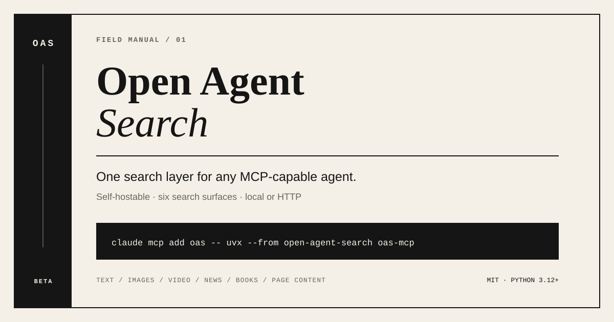
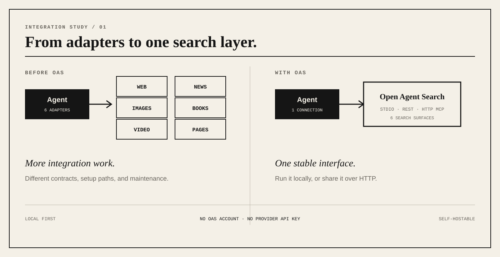
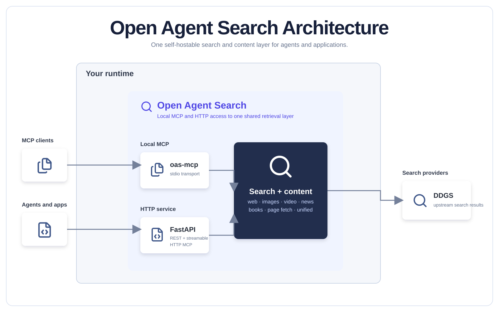
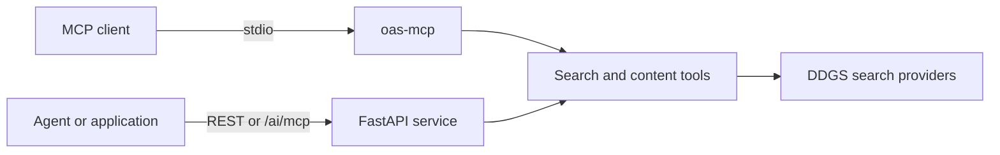

<p align="center">
  
</p>

<h1 align="center">Open Agent Search</h1>

<p align="center"><strong>One self-hostable search and content layer for AI agents and applications.</strong></p>

<p align="center">
  <a href="https://pypi.org/project/open-agent-search/"></a>
  <a href="https://www.python.org/"></a>
  <a href="LICENSE"></a>
  <a href="https://jayanth-mkv.github.io/open-agent-search/"></a>
</p>

<p align="center">
  <a href="#what-is-open-agent-search">What is OAS?</a> ·
  <a href="#try-it-in-30-seconds">Quick start</a> ·
  <a href="#capabilities">Capabilities</a> ·
  <a href="#architecture">Architecture</a> ·
  <a href="#search-surface">API surface</a> ·
  <a href="CONTRIBUTING.md">Contributing</a>
</p>

<p align="center">
  
</p>

## What is Open Agent Search?

Open Agent Search (OAS) is an independent retrieval layer for AI agents and applications. It provides one consistent search and content surface across local and deployed integrations.

OAS replaces separate adapters for every search vertical with one consistent tool surface. Run it locally for a single coding agent or deploy the HTTP service for shared agent and application workloads.

Search sources, transports, and client integrations can evolve without changing the repository's core goal: give agents and applications a dependable retrieval boundary they can control.

## Try it in 30 seconds

### Add search to Claude Code

```bash
claude mcp add oas -- uvx --from open-agent-search oas-mcp
```

Restart Claude Code, then ask it to search the web, news, images, videos, or books. The same `uvx` command works with Cursor, VS Code, Windsurf, OpenClaw, and other MCP clients.

<details>
<summary>Generic MCP configuration</summary>

```json
{
  "mcpServers": {
    "open-agent-search": {
      "command": "uvx",
      "args": ["--from", "open-agent-search", "oas-mcp"]
    }
  }
}
```

</details>

### Run the HTTP API

```bash
uv pip install open-agent-search
open-agent-search
```

Make a first search:

```bash
curl "http://localhost:8000/api/search/text?q=python+programming&max_results=5"
```

The server exposes REST endpoints at `http://localhost:8000`, interactive API docs at `/docs`, and streamable HTTP MCP at `/ai/mcp`.

## Capabilities

- **One search layer, multiple transports.** Use stdio MCP locally or serve REST and MCP over HTTP.
- **No provider API key required.** Search is powered by the `ddgs` library.
- **Self-hostable.** Run locally, in Docker, or deploy the HTTP service to Vercel.
- **Framework-independent.** The protocol surface works across major MCP clients and agent stacks.
- **Production-minded defaults.** Typed FastAPI routes, rate limiting, health checks, tests, and deployment guides are included.

<p align="center">
  
</p>

## Architecture

<p align="center">
  
</p>

The local MCP command and the HTTP service share the same search and content capabilities. Choose the connection path that matches where the consuming agent or application runs.

### Two deployment paths

| Path | Command or endpoint | Best for |
| --- | --- | --- |
| Local MCP | `uvx --from open-agent-search oas-mcp` | Giving a desktop or coding agent search with no persistent server |
| HTTP service | `open-agent-search` | Applications, shared agent environments, REST clients, and remote MCP |



## Search surface

| Capability | REST endpoint | MCP availability |
| --- | --- | --- |
| Text search | `GET /api/search/text` | Yes |
| Image search | `GET /api/search/images` | Yes |
| Video search | `GET /api/search/videos` | Yes |
| News search | `GET /api/search/news` | Yes |
| Book search | `GET /api/search/books` | Yes |
| Unified search | `GET /api/search/all` | Yes |
| Fetch one page | `GET /api/content/fetch` | Yes |
| Fetch multiple pages | `POST /api/content/fetch-multiple` | Yes |

See the [API reference](https://jayanth-mkv.github.io/open-agent-search/api/endpoints/) and [MCP tool reference](https://jayanth-mkv.github.io/open-agent-search/api/mcp-tools/) for parameters and response shapes.

## Privacy model

OAS does not require an OAS account or a search-provider API key, and it can run on infrastructure you control. Search queries still have to reach upstream search providers through DDGS, so this project should not be treated as an anonymity network. Review your deployment logs, network policy, and upstream-provider terms for sensitive workloads.

## Install and deploy

### From source

```bash
git clone https://github.com/jayanth-mkv/open-agent-search.git
cd open-agent-search
uv sync
uv run open-agent-search
```

### Docker

```bash
docker compose up -d
```

[](https://vercel.com/new/clone?repository-url=https%3A%2F%2Fgithub.com%2FJayanth-MKV%2Fopen-agent-search&project-name=open-agent-search&repository-name=open-agent-search)

Deployment details: [Docker](https://jayanth-mkv.github.io/open-agent-search/deployment/docker/) · [Vercel](https://jayanth-mkv.github.io/open-agent-search/deployment/vercel/)

## Documentation

- [Installation](https://jayanth-mkv.github.io/open-agent-search/getting-started/installation/)
- [Quick start](https://jayanth-mkv.github.io/open-agent-search/getting-started/quickstart/)
- [MCP integrations](https://jayanth-mkv.github.io/open-agent-search/mcp/)
- [API endpoints](https://jayanth-mkv.github.io/open-agent-search/api/endpoints/)
- [Contributing](https://jayanth-mkv.github.io/open-agent-search/contributing/)

## Development

```bash
uv sync --group dev
uv run pytest
uv run ruff check .
```

Open Agent Search is currently beta software. Bug reports and focused pull requests are welcome; see [CONTRIBUTING.md](CONTRIBUTING.md).

## License

[MIT](LICENSE)
